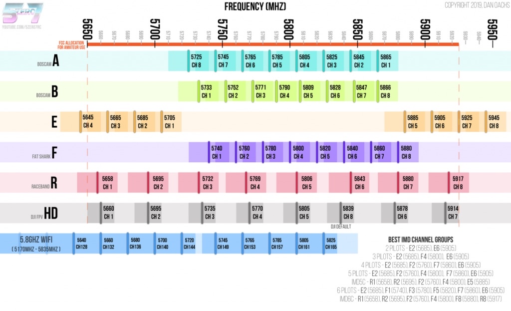

# Useful Links/Resources

A curated collection of valuable FPV resources, tutorials, and educational content.

## Sites

### [Oscar Liang](https://oscarliang.com/)
Comprehensive FPV drone tutorials, reviews, and guides. One of the most trusted resources in the FPV community, covering everything from beginner guides to advanced topics. Features detailed product reviews, build guides, shopping lists, and in-depth technical explanations.

### [Joshua Bardwell - YouTube Channel](https://www.youtube.com/@JoshuaBardwell/playlists)
Popular FPV educator with over 410k subscribers and 3,100+ videos. Well-organized playlists covering Betaflight configuration, drone builds, ExpressLRS, EdgeTX, beginner guides, and much more. Excellent for both newcomers and experienced pilots looking to deepen their understanding.

## Pages

### [Calculate FPV Range](https://oscarliang.com/calculate-fpv-range)
Comprehensive guide to understanding and calculating FPV range using decibels (dB). Explains how antenna gain, VTX power, and receiver sensitivity affect your signal range. Includes practical formulas, conversion tables (mW to dBm), and real-world examples. Essential reading for optimizing your FPV setup and understanding why increasing power by 4x (6dB) doubles your range.

### [Best FPV Antenna Guide](https://oscarliang.com/best-fpv-antenna/)
Ultimate guide to FPV antennas covering antenna types (monopole, dipole, cloverleaf, pagoda, helical, patch, crosshair), polarization (linear vs circular), gain, radiation patterns, SWR, and mounting considerations. Includes recommendations for both VTX and VRX antennas, connector types, and practical tips for choosing the right antenna for your specific use case.

### [FPV Antenna SWR Plots](https://oscarliang.com/fpv-antenna-swr/#Maple-Leaf-Patch-85dBi)
Extensive collection of SWR (Standing Wave Ratio) measurements for popular FPV antennas. Helps you identify the best frequency/channel for optimal performance with your specific antenna. Features tested data on dozens of antennas including Foxeer Lollipop series, TrueRC Singularity, RushFPV Cherry, and many more. Invaluable resource for fine-tuning your video link quality.

## Resources 

### 